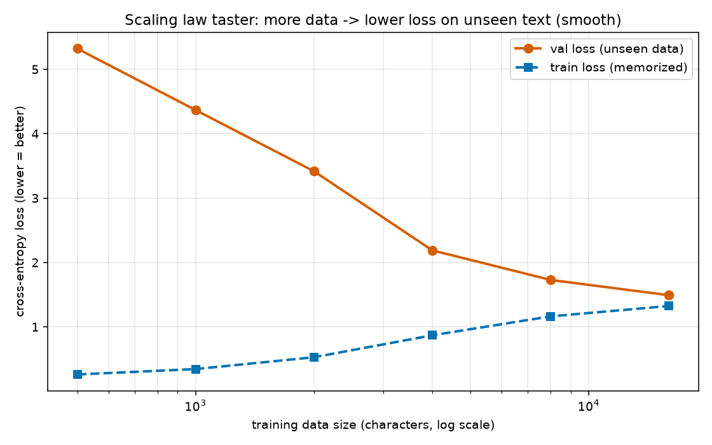
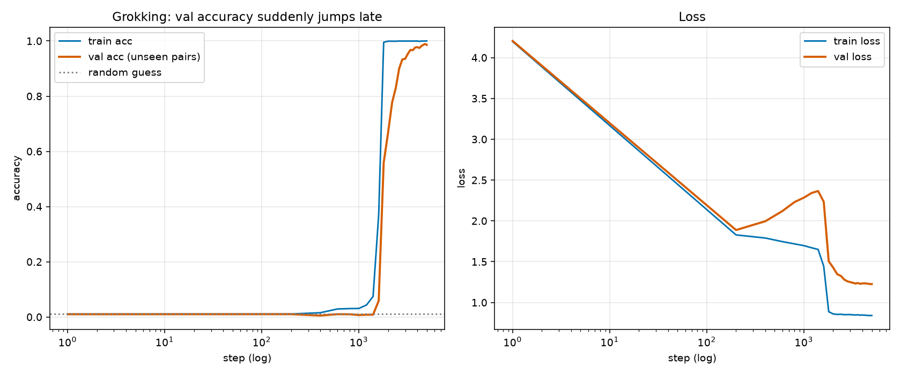
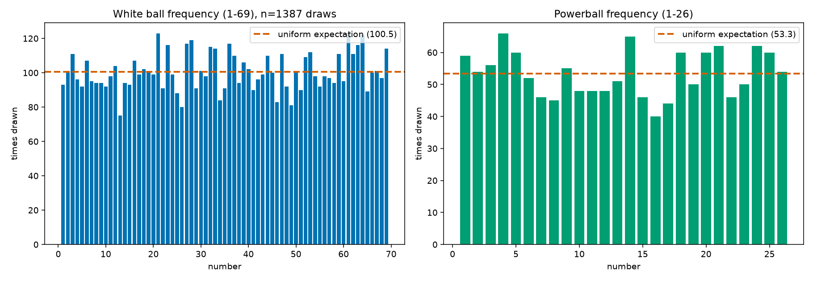
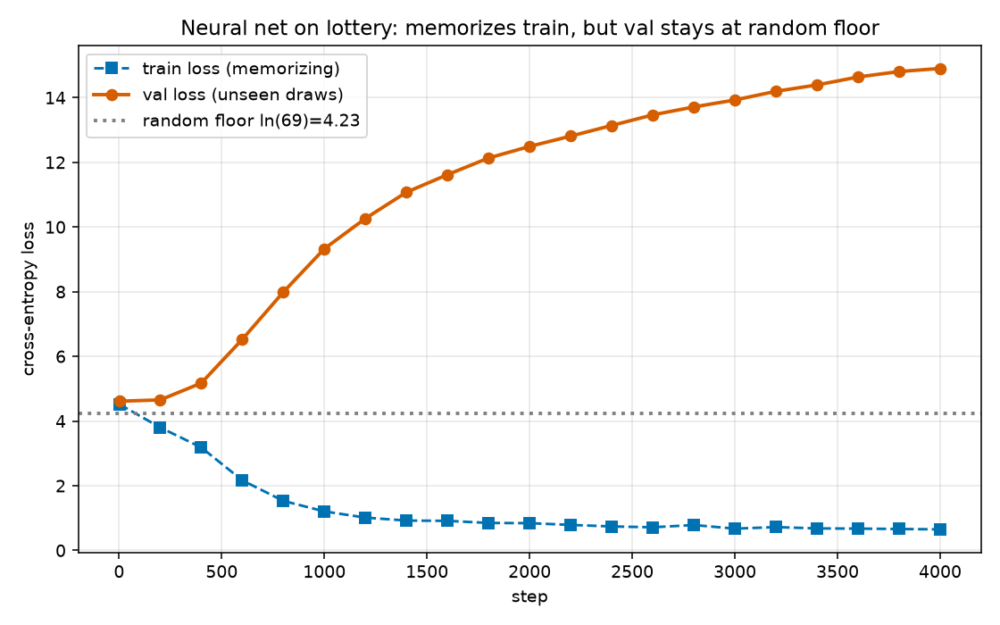

# 밑바닥부터 만드는 미니 LLM — 이론 탐험 기록

순수 **NumPy**로, **역전파를 손으로** 구현하며 LLM의 핵심 이론을 밑바닥부터 훑은 기록이다.
기존 라이브러리를 갖다 쓰는 게 아니라 "글자를 숫자로 바꾸는 것"부터 "self-attention의
역전파"까지 직접 짰다. autograd(자동미분)를 쓰지 않는 이유는, **학습이 실제로 무엇을
계산하는지**를 눈으로 보기 위해서다.

리소스가 딸려도 된다. CPU에서 몇 초~몇 분이면 loss가 내려가고 그럴듯한 결과가 나온다.

---

## LLM은 결국 4조각이다

1. **토크나이저** — 텍스트 ↔ 숫자. `"안녕" → [12, 87]`
2. **모델(신경망)** — "지금까지의 토큰 → 다음 토큰의 확률분포"를 계산하는 함수. 핵심은 self-attention.
3. **학습(training)** — 예측과 정답의 차이(loss)를 **역전파**로 각 가중치에 미분하고, 그 반대 방향으로 조금씩 옮긴다(경사하강). 수천~수백만 번 반복.
4. **생성(inference)** — 학습된 모델로 다음 토큰을 하나씩 뽑아 이어붙인다.

용어가 헷갈리면 → [GLOSSARY.md](GLOSSARY.md) (모든 용어를 쉬운 뜻 + English로 정리)

---

## 파일 지도

| 파일 | 내용 |
|---|---|
| `tokenizer.py` | **①** 글자 ↔ 숫자 변환 |
| `01_bigram.py` | 신경망 없이 '세기'로 만드는 언어모델 |
| `02_mlp.py` | 신경망 + **역전파 직접 구현** (학습의 심장) |
| `03_transformer.py` | self-attention 미니 GPT, 역전파 전부 손으로 |
| `04_backprop_one_step.py` | 역전파 '한 걸음'을 숫자 하나로 추적 |
| `05_model_save_load.py` | 학습 결과를 '모델 파일'로 저장 / 불러오기 |
| `06_scaling_law.py` | 데이터를 늘리면 loss가 어떻게 변하나 (스케일링 법칙) |
| `07_grokking.py` | 그로킹: 외우다가 어느 순간 '규칙 발견' |
| `08_grokking_use.py` | 그로킹 모델을 불러와 계산기로 검증 |
| `09_lottery.py` | 복권 빈도 모델 + '무작위를 못 이긴다' 백테스트 |
| `10_lottery_predict.py` | 복권 번호 예측 도구 (샘플링/hot/cold) |
| `11_lottery_nn.py` | 신경망에 복권을 학습시키면? (외우기만 함) |
| `minigpt.py` | 실험용으로 재사용하는 깔끔한 미니 GPT (03과 동일한 수학) |

**데이터**: `corpus.txt`(사계절 산문 2천자), `corpus_kor.txt`/`corpus_eng.txt`(화성 커플 이야기 한/영), `export.csv`(파워볼 당첨 이력).

---

## 1단계 — 토크나이저: 텍스트를 숫자로

모델은 글자를 모르고 숫자만 안다. 모든 고유 글자에 번호를 매긴다.
```
'아침에 눈을 뜨면' → [176, 258, 189, 1, 50, 215, 1, 85, 119]
```

## 2단계 — Bigram: 신경망 없이 '세기'

"언어모델 = 다음 글자 확률"을 신경망 없이 체감한다. 앞 글자 다음에 어떤 글자가 몇 번
나왔나 세기만 한다. loss는 **무작위 5.62 → 4.03**으로 내려간다(= 뭔가 '배움').

## 3단계 — MLP: 여기서 '진짜 학습(역전파)'이 등장

학습의 4단계 루프가 처음 등장한다: **순전파 → loss → 역전파 → 갱신**. 역전파를 손으로
구현하고, **수치미분과 비교(gradient check)해 정확성을 검증**한다(상대오차 ~1e-8 통과).
```
loss: 5.63 (시작) → 0.226 (끝)   # 학습이 도는 걸 눈으로
```

## 4단계 — 미니 GPT (Transformer)

self-attention + LayerNorm + 잔차연결까지 **역전파를 전부 손으로**. 전체 모델 gradient
check 통과. loss **6.04 → 0.29**, 한국어 문장 생성.

## 확대경 — 역전파 '한 걸음'

가중치 하나(`W[0,1]`)를 골라 `순전파 → loss → 역전파(기울기) → 갱신`을 손계산으로 추적:
```
기울기 dL/dW[0,1] = -0.6764   (수치미분과 일치 ✅)
갱신 후: loss 1.1284 → 1.0831, 정답 확률 32.4% → 33.9%  # 한 걸음 = 이만큼
```

## 모델 저장/불러오기 — "모델 파일"의 정체

학습 결과(가중치)를 `.npz`로 저장하면, 재학습 없이 불러와 즉시 생성할 수 있다.
```
train(학습+저장): 17.7초   →   model_kor.npz (555KB, 파라미터 70,169개)
gen(불러오기+생성): 0.11초  # 학습 안 함!
```
| 구성 | 이 프로젝트 | 실제 GPT/HuggingFace |
|---|---|---|
| ① 학습된 가중치 | `.npz`의 배열들 | `model.safetensors` |
| ② 구조 설정 | `.npz`의 T, D | `config.json` |
| ③ 토크나이저 | `.npz`의 vocab | `tokenizer.json` |

---

## 실험 1 — 스케일링 법칙: 데이터를 늘리면?

같은 모델을 학습 데이터 양만 2배씩 늘려 학습. **val loss가 매끄럽게 내려간다(절벽 아님).**



| 데이터 | train loss | val loss(처음 보는 글) | 과적합 gap |
|---:|---:|---:|---:|
| 500자 | 0.26 | 5.32 | 5.06 |
| 4,000 | 0.87 | 2.19 | 1.32 |
| 16,000 | 1.32 | 1.49 | **0.17** |

데이터가 적으면 통째로 외워(train↓, val↑) 과적합. 데이터가 많아지면 '규칙'을 배워
일반화(gap↓). "지능이 뿅 생기는 특이점"은 이 매끄러운 곡선이 수십 자릿수에 걸쳐 이어진
결과지, 한 점의 도약이 아니다.

## 실험 2 — 그로킹(Grokking): 외우다가 갑자기 '이해'

과제: `(a+b) mod 97`. 강한 weight decay + 긴 학습을 주면, train은 일찍 100%인데 val은
바닥에 있다가 **어느 순간 급격히 점프**한다. 암기 → 규칙 발견의 상전이.



```
07: val 정확도 0.01(찍기) → 0.99 (best checkpoint 저장)
08: 학습에 '없던' 쌍 테스트 → 12/12 정답, 전체 미학습 4705쌍 정확도 98.9%
    예) 45 + 70 = 18  (실제 115 mod 97 = 18 ✅)
```
스케일링의 '매끄러움'과 대비되는 **진짜 급격한 상전이**. 그리고 이 모델은 답을 외운 게
아니라 규칙을 익혀서, 처음 보는 입력도 계산해낸다.

> ⚠️ 이 설정(wd=1.0)은 학습이 불안정하게 진동(붕괴↔회복)한다. 그래서 마지막이 아니라
> **가장 좋았던 시점(best checkpoint)을 저장**한다 — 실무에서도 흔한 방식.

---

## 복권 실험 — ML은 무작위를 못 이긴다

> 복권 추첨은 매 회 **독립적인 무작위 사건**이라, 어떤 모델도 다음 번호를 확률 이상으로
> 못 맞힌다. 아래 실험들은 그걸 **직접 증명**한다. (재미 + 교육용)

### (A) 빈도 모델 `09_lottery.py` — 01_bigram과 같은 '세기' 모델

과거 번호의 빈도를 학습해 티켓을 뽑는다. 빈도 분포는 거의 완벽히 균등하다(뚜렷한 편향 없음).



**백테스트 (최근 300회차):** '학습된' 모델과 무작위가 통계적으로 동일 = 학습이 이득 없음.

| | 평균 맞은 흰공(5개 중) | 파워볼 적중률 |
|---|---:|---:|
| '학습된' 빈도 모델 | 0.361 | 0.0374 |
| 순수 무작위 | 0.364 | 0.0387 |
| 이론적 기대 | 0.362 | 0.0385 |

1등 확률 = **1 / 292,201,338** (어떤 모델도 못 바꾼다).

### (B) 예측 도구 `10_lottery_predict.py`

```bash
uv run python 10_lottery_predict.py 5        # 샘플링 5장 (실행마다 다름)
uv run python 10_lottery_predict.py 3 42     # 씨앗 42 (재현 가능)
uv run python 10_lottery_predict.py hot      # 최다 출현 번호 (고정)
uv run python 10_lottery_predict.py cold     # 최소 출현 번호 (고정)
```
샘플링은 과거 빈도에 **비례**해 뽑는다(균등 아님) → "학습된 모델"이 맞다. 다만 그 빈도차는
노이즈라 적중엔 도움이 안 된다. hot/cold를 믿는 건 **도박사의 오류(gambler's fallacy)**.

### (C) 신경망에 복권 학습 `11_lottery_nn.py` — 외우기만 하고 예측은 못 함

MiniGPT에 복권 흰공 시퀀스를 학습시켰다(정렬 패턴은 섞어서 제거 → 신호 0).



```
        train loss    val loss   (무작위 바닥 ln69=4.234)
step 1     4.52         4.61
step 4000  0.65        14.90     # train은 외워서 ↓, val은 오히려 ↑↑
val 다음 번호 top-1 적중률 = 1.30%   (무작위 = 1.45%)
```
train loss는 폭락(= 암기)하지만 val loss는 무작위 바닥보다 **위로 폭등**한다 — 외운 패턴을
처음 보는 회차에 **자신 있게 틀리게** 적용하기 때문. 정작 적중률은 찍기와 동일.

### 복권 스크립트 사용법

```bash
# 빈도 모델: 분석 + 백테스트(무작위와 동일함을 증명) + 빈도 그래프 저장
uv run python 09_lottery.py

# 번호 뽑기 (10_lottery_predict.py)
uv run python 10_lottery_predict.py          # 샘플링 1장
uv run python 10_lottery_predict.py 5        # 샘플링 5장 (실행마다 다름)
uv run python 10_lottery_predict.py 3 42     # 3장 + 씨앗 42 (재현 가능)
uv run python 10_lottery_predict.py hot      # 최다 출현 번호 (항상 고정)
uv run python 10_lottery_predict.py cold     # 최소 출현 번호 (항상 고정)

# 신경망에 복권 학습 (외우기만 하고 예측은 못 함을 확인)
uv run python 11_lottery_nn.py
```

- **데이터:** `export.csv` (2열=당첨번호, 마지막 숫자=파워볼). 규칙이 바뀐 2015-10-07 이후 회차만 사용.
- **샘플링**은 과거 빈도에 비례(균등 아님)해 뽑지만, 그 빈도차는 노이즈라 적중엔 무의미하다. hot/cold를 믿는 건 도박사의 오류.
- **산출물:** `lottery_freq.png`(빈도 그래프), `lottery_nn.png`(신경망 학습 곡선).
- ⚠️ 재미·교육용. 어떤 방식이든 1등 확률은 1/292,201,338로 동일하다.

---

## 오늘의 결론 — 모델의 능력은 '데이터의 신호'에 달렸다

같은 신경망(MiniGPT)인데 데이터에 따라 정반대 결과가 나왔다:

| 데이터 | 신호 유무 | val loss | 결과 |
|---|---|---|---|
| 한국어 텍스트 | **있음**(문법·단어) | 바닥보다 아래로 ↓ | 학습 성공, 문장 생성 |
| 모듈러 덧셈 | **있음**(규칙) | 그로킹으로 ↓ | 규칙 발견, ~100% |
| 복권 | **없음**(무작위) | 바닥보다 위로 ↑ | 노이즈 암기, 예측 불가 |

- **학습이 통하려면 데이터에 신호가 있어야 한다.** 신호가 있으면 신경망이 규칙을 뽑아
  일반화하고, 없으면 아무리 크고 오래 학습시켜도 노이즈를 외우다 끝난다(과적합).
- **"AI가 만능"이 아니다.** 모델은 데이터에 없는 패턴을 결코 만들어내지 못한다.
- GPT는 이 폴더의 원리를 **규모만 키운 것**이다: 글자→BPE 토크나이저, 블록 여러 층·
  multi-head, 방대한 데이터, GPU, 그리고 정렬(RLHF) 단계.

---

## 실행

```bash
cd mini-llm

uv run python tokenizer.py                 # 토크나이저
uv run python 01_bigram.py                 # 세기 모델
uv run python 02_mlp.py                     # 역전파 학습
uv run python 03_transformer.py            # 미니 GPT
uv run python 04_backprop_one_step.py      # 역전파 한 걸음

uv run python 05_model_save_load.py train corpus_kor.txt model_kor.npz 3000
uv run python 05_model_save_load.py gen model_kor.npz "화성"

uv run python 06_scaling_law.py            # 스케일링 그래프
uv run python 07_grokking.py               # 그로킹 학습 + 그래프 + 모델 저장
uv run python 08_grokking_use.py 45 70     # 그로킹 모델로 계산

uv run python 09_lottery.py                # 복권 빈도 모델 + 백테스트
uv run python 10_lottery_predict.py 5      # 복권 번호 뽑기
uv run python 11_lottery_nn.py             # 신경망에 복권 학습
```

## 환경
- Python 3.14, NumPy(연산), matplotlib(그래프). uv로 관리.
- 코퍼스는 아무 `.txt`로 교체 가능(글자 단위라 언어 무관).
