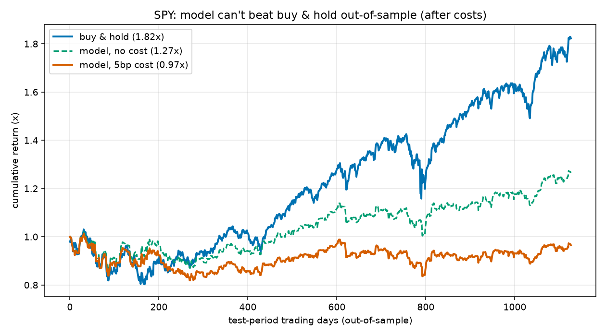
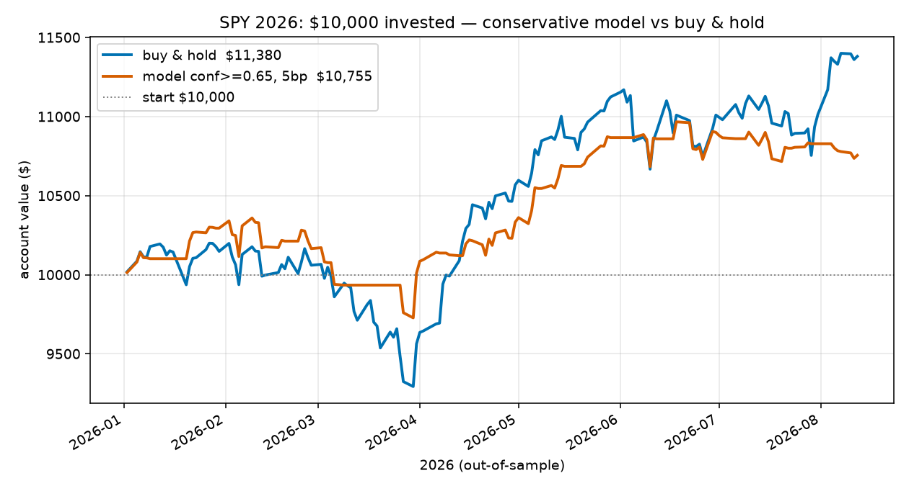
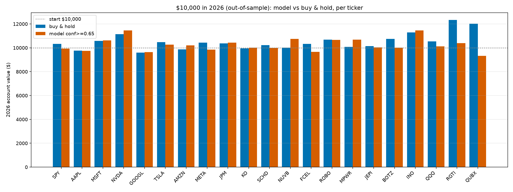

# 주식 방향 예측 — 그리고 왜 안 되는가 (정직한 실험)

과거 시세로 '내일 오를까/내릴까'를 맞히는 모델을 밑바닥부터 만들고, **실제 달러로**
백테스트해서 "ML이 시장을 이기는가?"를 검증한 기록이다.

> **결론 먼저:** 못 이긴다. 정교하게(신뢰도 임계값·보수적 매매) 만들어도, 거래비용 후·
> 표본을 늘리면 **그냥 사서 들고 있기(buy & hold)를 못 이긴다.** 이건 의견이 아니라
> 아래 실험의 달러 결과다. (투자 자문 아님 — 교육용.)

시장은 [복권](README.md)처럼 신호가 0은 아니다. 하지만 신호가 **약하고, 적대적이고
(발견되면 사라짐), 비정상적(규칙이 변함)**이라 — 무엇보다 **자기를 속이기 쉽다**.

---

## 파이프라인 (재사용 가능한 3단계)

```bash
# ① 데이터 받기 — 항상 최신까지. 티커 없으면 쓰던 종목 전부, 주면 그 종목만
uv run python fetch_data.py               # 전체 갱신
uv run python fetch_data.py NFLX AMD      # 특정 티커

# ② 전체 학습 → 모델 저장 ({티커}_model.npz)
uv run python 15_stock_train.py           # 받아둔 모든 종목
uv run python 15_stock_train.py AAPL      # 하나만

# ③ 저장된 모델로 다음 거래일 예측 + confidence + 추천
uv run python 16_stock_predict.py         # 저장된 모든 모델
uv run python 16_stock_predict.py AAPL
```

세 단계 모두 **티커 없으면 전체 / 주면 그 종목**, 파일명은 소문자 티커 접두어로 통일한다.

### 모델(`{티커}_model.npz`) 구성 — "모델 파일"의 정체
- **가중치** W1, b1, W2, b2 (작은 MLP: 입력 15 → 은닉 64 → 2-class)
- **표준화 통계** mu, sd (예측 때도 같은 방식으로 정규화)
- **설정/메타** K=15, ticker, 마지막 학습일, 표본 수

### 매매 규칙 (보수적 신뢰구간)
입력 = 직전 15거래일 수익률 → 모델이 `P(오름)` 출력. 그걸로:
- `P(오름) ≥ 0.65` → **매수(long)**
- `P(오름) ≤ 0.35` → **현금(flat)**
- 그 사이 → **관망(직전 포지션 유지)** — 애매하면 거래 안 함(비용 절약)

---

## 사용법 — 처음부터 끝까지

모든 스크립트는 **티커를 주면 그 종목, 안 주면 전체**로 동작한다.

### 시나리오 A — 새 종목 하나를 처음부터 예측까지
```bash
uv run python fetch_data.py NFLX          # ① 최신 데이터 받기 -> nflx_data.json/.csv
uv run python 15_stock_train.py NFLX      # ② 전체 학습 -> nflx_model.npz
uv run python 16_stock_predict.py NFLX    # ③ 다음 거래일 예측 + confidence
```

### 시나리오 B — 갖고 있는 종목 전부 최신화 후 한 번에
```bash
uv run python fetch_data.py               # 받아둔 종목 전부 최신 갱신
uv run python 15_stock_train.py           # 전부 학습(*_model.npz)
uv run python 16_stock_predict.py         # 전부 예측(확신 높은 순 정렬)
```

### 시나리오 C — 백테스트로 '진짜' 검증 (돈으로)
```bash
uv run python 12_stock.py                 # SPY: in-sample vs out-of-sample 착시
uv run python 13_stock_2026.py            # SPY 2026 confidence 매매 ($ 손익)
uv run python 14_stock_multi.py           # 여러 종목 일괄 비교(요약 그래프)
```
실험 조건은 `14_stock_multi.py` 상단 상수로 바꾼다:

| 상수 | 뜻 | 기본값 |
|---|---|---|
| `TICKERS` | 비교할 종목 목록 | 21개 |
| `TRAIN_END` / `TEST_START` | 학습/미래 경계 | ~2025-12-31 / 2026-01-01 |
| `HI`, `LO` | 매수/현금 신뢰 임계값 | 0.65 / 0.35 |
| `CAPITAL` | 초기 투자금($) | 10,000 |
| `COST` | 거래비용(포지션 변경당) | 0.0005 (5bp) |

### 출력 해석 (중요)
- `16_stock_predict` 의 `P(오름)` 은 클수록 매수 신호. **단, 99% 같은 극단값은 확신이 아니라
  과적합**이다(데이터 적은 종목일수록 심함). 오히려 밋밋한 확률이 더 정직한 모델.
- `15_stock_train` 이 찍는 in-sample 정확도는 **예측력이 아니다.** 미래엔 무작위 수준.
- 산출 파일: `{티커}_model.npz`(모델), `{티커}_trades_2026.csv`(백테스트 거래내역),
  요약 그래프 `stocks_2026_summary.png`.

> 요약 흐름:  **fetch_data.py → 15_stock_train.py → 16_stock_predict.py**
> (진짜 검증이 필요하면 12~14로 과거 데이터에 백테스트.)

---

## 실험과 결과 (실제 달러)

### 1. 백테스트 착시 — `12_stock.py` (SPY, 15년)
시간순 분할(학습 70% / 미래 30%)로 정직하게 검증.



| 지표 | 값 |
|---|---|
| in-sample 정확도 | **79%** (예측되는 것처럼 보임) |
| out-of-sample 정확도 | **50.2%** (동전 던지기) |
| buy & hold (미래 구간) | 1.82배 |
| 모델 전략 (거래비용 5bp) | **0.97배 (원금 손실)** |
| (참고) 학습 구간에서 평가한 전략 | **461.8배** ← 착시! |

461배는 학습 데이터의 노이즈를 외운 것. 미래엔 50%로 무너진다.

### 2. 2026년 보수적 매매 — `13_stock_2026.py` (SPY)
학습 ~2025-12-31, 2026년(진짜 미래)에 confidence≥0.65로만 매매. $10,000 투자 시:



| 방법 | 최종 잔고 | 손익 |
|---|---:|---:|
| 그냥 보유 | **$11,380** | +$1,380 |
| 모델(보수적, 비용 5bp) | $10,755 | +$755 |

확신한 날의 실제 상승률 55.3% ≈ 전체 평균 53.6% → **confidence는 결과와 무관(허수)**.

### 3. 여러 종목 — `14_stock_multi.py` (21개, 2026년)


| 창(window) | 모델 승 | 전체 buy&hold | 전체 모델 | 차이 |
|---|---|---:|---:|---:|
| 2026 전체(153일) | 7/21 (33%) | $235,358 | $204,553 | **−$30,806** |
| 8월만(8일) | 9/21 (43%) | $220,919 | $215,267 | −$5,652 |

- **FCEL 참사:** 그냥 보유 시 3배($30,534)로 오른 걸, 모델이 현금으로 빠져 놓침 → $8,530(−$22,003). "예측해서 피하기"는 **최고의 상승을 놓칠 위험**을 떠안는다.
- **승률이 창마다 요동(33%↔43%)** = 실력이 아니라 운. 진짜 신호면 안 흔들린다.

---

## 핵심 교훈

1. **in-sample ≠ 예측력.** 학습 데이터 정확도(79%, 461배)는 과적합일 뿐. 미래는 50%.
2. **과적합일수록 confidence가 높다.** `15`에서 데이터 적은 QUBX는 in-sample 100%,
   `16`에서 99.7% 확신을 뱉는다 — **가장 확신하는 신호가 가장 못 믿을 신호**다.
3. **거래비용이 얇은 우위를 먹는다.** 방향이 반반이면 사고팔수록 비용만 샌다.
4. **표본을 늘릴수록 진다.** 6→10→21종목으로 갈수록 전체 손실이 뚜렷해진다.
5. **짧은 기간은 위험하다.** 8일 백테스트의 "9승"은 운. 판단하려면 긴 기간이 필요하다.
6. **"피하기"의 함정.** 시장 수익은 소수의 폭발적 구간에서 나오는데, 못 맞히는 모델이
   빠져 있으면 그 대박을 놓친다(FCEL·QUBX).

> 종합: 신호가 약하고 적대적인 시장에선, 모델을 아무리 다듬어도 벽을 못 넘는다.
> [텍스트·덧셈(신호 있음)에선 학습이 통했지만](README.md), 주식(신호 약함+착시)에선
> 안 통한다 — 이 스펙트럼을 실제 달러로 확인했다.

---

## 파일 지도

| 파일 | 역할 |
|---|---|
| `fetch_data.py` | 시세 다운로더 (Yahoo, 항상 최신 일별) → `{티커}_data.json` / `.csv` |
| `12_stock.py` | 백테스트 착시 데모 (in-sample vs out-of-sample) |
| `13_stock_2026.py` | 2026년 단일 종목, confidence 매매 |
| `14_stock_multi.py` | 여러 종목 일괄 비교 |
| `15_stock_train.py` | 전체 데이터 학습 → `{티커}_model.npz` 저장 |
| `16_stock_predict.py` | 저장된 모델로 다음 거래일 예측 |

**데이터/산출물:** `{티커}_data.json`·`.csv`(시세), `{티커}_model.npz`(모델),
`{티커}_trades_2026.csv`(거래내역), `spy_backtest.png`·`spy_2026.png`·`stocks_2026_summary.png`(그래프).

## 환경 · 주의
- Python 3.14 + NumPy(연산) + matplotlib(그래프). 데이터는 Yahoo Finance(무료, 키 없음).
- `Adj Close`(배당·분할 반영)로 수익률 계산.
- **투자 자문이 아니다.** 예측의 미래 적중률은 무작위 수준이며, 실제 투자에 쓰지 말 것.
